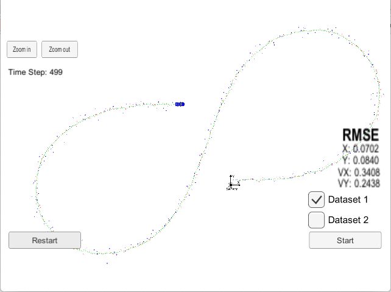

# Unscented Calman Filter (UKF) Implementation

## Project Intro

This project implements UKF in C++.  UKF is used to track an object position based on lidar and radar sensor fusion.
UKF relies on non-linear CTRV (Constant Turn Rate and Velocity) model.  To obviate the need to calculate Jaconbians and 
linearly approximate the model, UKF generates sigma points.  UKF makes prediction of the mean and covariance matrix for 
the sigma points only.  Then, UKF uses the incoming measurements to update the object position.  

## Running Project 
Please refer to the original Udacity project [README](./README_orig.md)

## Project Output (UKF)

The blue dots are radar measurements, the red dots are laser measurements, and the green dots are the UKF tracking results.
The positions of green dots are sent from [main.cpp](./main.cpp) to the simulator.

Over the run of the simulation, Root Mean Square Error (RMSE) is calculated for the position and the velocity predictions.  The ground
truth values for the calculation are supplied by the simulator.  The estimations are accumulated, such that each RMSE value is 
cumulative at each moment.  The simulator displays RMSE in the lower corner.  UKF RMSE is smaller than EKF's, because CTRV model 
is better at predicting non-linear motion. 

## EKF Output

For this project, we had to find and set our own standard deviation of acceleration and of yaw acceleration values.
I cheated by reading off the ground truth values from the data and finding the maximum tracked object acceleration
and yaw acceleration.  After rounding the values off to the nearest integer value, I set the standard deviation of 
acceleration and of yaw acceleration to 1.0 and 2.0, respectively.  (The code in [main.cpp](./main.cpp) is commented out)

Normally, NIS (Normalized Information Squared) analysis is used to choose the noise standard deviation values.  NIS 
analysis result shows how well a model with the chosen standard deviations predicts the reality. 
If the chosen std. deviations are consistent with the reality, the computed NIS values should roughly obey a chi-square 
distribution for the corresponding number of degrees of freedom.  According to the Chi-Square table presented in
the lecture, for radar's 3 degrees of freedom, 95% of all NIS values should be below 7.815.  For lidar's 2 degrees of freedom,
95% of all NIS values should be below 5.991.

Running NIS analysis with the standard deviation of acceleration and of yaw acceleration set to 1.0 and 2.0, I found that 
about 3.6% of radar NIS values were above 7.815.  For lidar, 2.8% of NIS values were above 5.991.

## Plots of NIS Values against Chi-Square 5% Probability Values 

If NIS values were much lower than the Chi-Square value, it would mean that standard deviations of the process noise were 
overestimated, and vice versa.